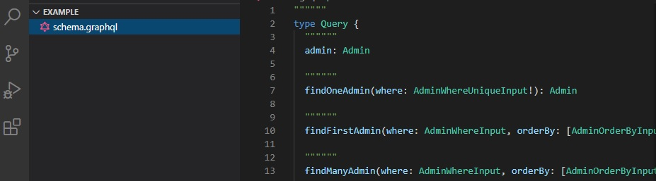
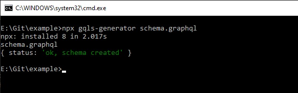
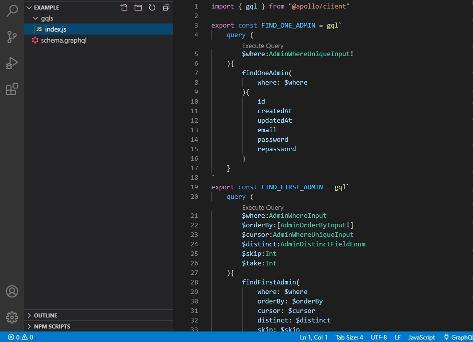
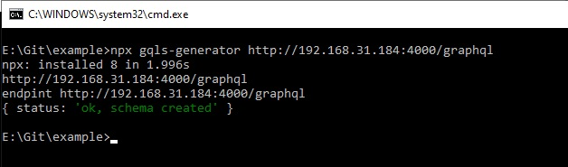

# gqls-generator

gqls-generator is a package to generate client queries and mutations from GraphQL schema or remote server

## Usage

```
Usage: npx gqls-generator [ENDPOINT or PATH to graphql schema] [OPTIONS]

Fetch and print the GraphQL schema from a GraphQL HTTP endpoint
(Outputs schema in IDL syntax by default)

Options:
 -h    Add a custom header (ex. 'API-KEY=ABC123 AUTH=SJF68dFsx')
 -m    Add a fetch method (POST or GET) 
```

Example from local schema:

```
npx gqls-generator schema.graphql
```






Example from remote server:

```
npx gqls-generator http://192.168.31.184:4000/graphql
```





